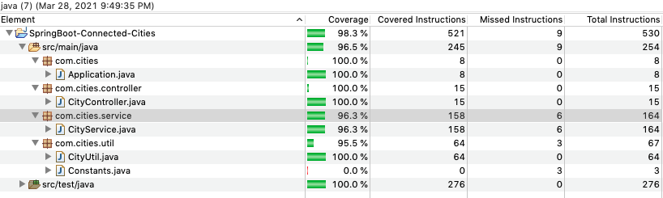

# Connected Cities

This project skeleton is created using https://start.spring.io/ by selecting Java 11, SpringBoot 2.3.9, Gradle as a build tool, actuator, lombok. Later added dependency for springdoc-openapi for API documentation.

## Requirements (Tools and Technologies)

- [Java 11](https://www.oracle.com/java/technologies/javase-downloads.html)
- [Gradle](https://gradle.org/install/)
- [Lombok](https://projectlombok.org/setup/eclipse)
- [STS](https://spring.io/tools)
- [OpenAPI Specification](https://swagger.io/specification/)

## Build instructions

- `./gradlew clean`
- `./gradlew build`
- `java -jar build/libs/SpringBoot-Connected-Cities-0.0.1-SNAPSHOT.jar`

## Implementation Details:

- This application is a gradle project.
- Uses most latest stable SpringBoot verison 2.3.9
- Uses lombok for logging.
- Uses Java File Reader to read file from `src/main/resources` directory.
- Uses OpenAPI Swagger for API documentation.
- Actuator for Health monitoring.
- Junit 5 for unit tests

## Flow

Controller -> Service Layer -> CityUtil

## Various ways to access the api end-points are:

- `http://localhost:8080/connected?origin=Boston&destination=Newark`
- Swagger URL for local `http://localhost:8080/swagger-ui.html`
- Curl URL: `curl -X GET 'http://localhost:8080/connected?origin=Boston&destination=Newark'`
- Postman (Would be more useful if you have collections of API)

## Swagger UI

## Project Structure

## Junits

- Unit tests are written for each layer:
  - Unit tests for Controller
  - Unit tests for Service layer
  - Unit tests for Util class

## Code Coverage

